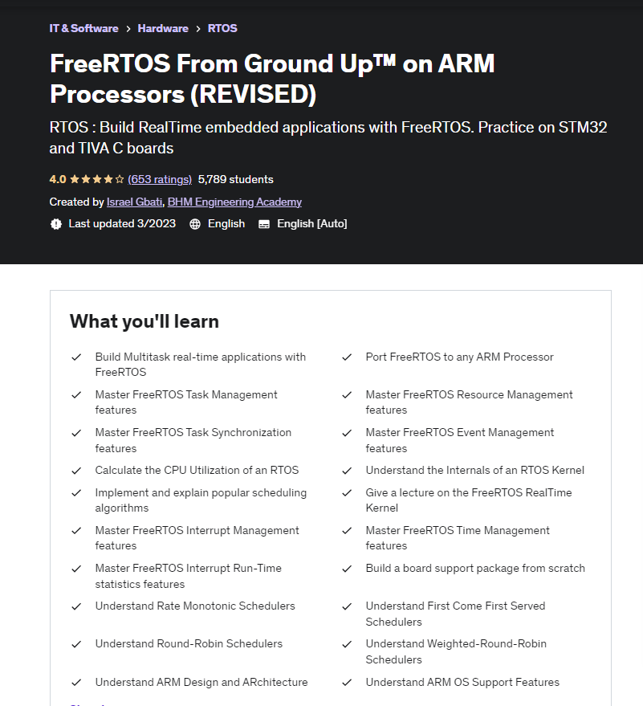

# FreeRTOS From Ground Up on ARM Processors
Foundations of real-time systems and how to build real-time applications using FreeRTOS

## Summary
The content within this repository is my own work produced as a result of completing the course  "FreeRTOS From Ground Up on ARM Processors" , authored by Israel Gbati.
* https://www.udemy.com/course/freertos-on-arm-processors/learn/lecture/26149444

The source code is tested on STM32 Nucleo 144 family boards.
* https://www.st.com/en/evaluation-tools/nucleo-f429zi.html

### IDE used
STM32CubeIDE - https://www.st.com/en/development-tools/stm32cubeide.html

### Description

> This course teaches you the foundations of real-time systems and how to build real-time applications using FreeRTOS ,one of the most popular real-time operating systems  for embedded systems.
> 
>  By the end of this course you should be able to build your own multitask FreeRTOS  real-time applications which use all the features of a modern real-time application (such as semaphores, mutexes, event flags, hooks, queues, mailboxes etc )and  test their performance.

### About me
* George Calin
* george.calin [at] gmail.com
* LinkedIn: https://www.linkedin.com/in/cgeorge1978/
